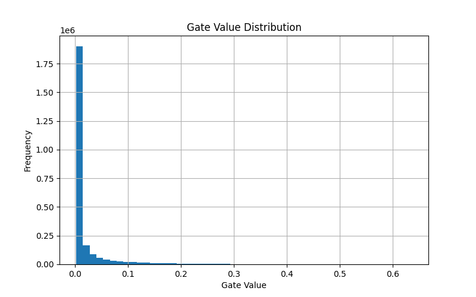

# Self-Pruning Neural Network

A research-oriented deep learning project that implements a **neural network capable of pruning itself during training** using learnable gates and sparsity regularization.

---

## Overview

Traditional neural network pruning is performed  *after training* , requiring additional steps and heuristics.

This project introduces a **self-pruning architecture** where:

* Each weight is associated with a learnable gate
* The network dynamically decides which connections to keep or remove
* Sparsity emerges naturally during training

This approach enables  **model compression and efficiency without post-processing** .

---

## Key Features

* Custom `PrunableLinear` and `PrunableConv2d` layers
* Learnable gating mechanism using sigmoid activation
* L1-based sparsity regularization
* Multi-λ experiments to study sparsity vs accuracy trade-off
* Visualization of gate distribution
* GPU-accelerated training (PyTorch)

---

## Architecture

* Input: CIFAR-10 images (32×32×3)
* 3 Convolutional Blocks (PrunableConv2d + BatchNorm + ReLU + MaxPool)
* 2 Fully Connected Layers (PrunableLinear)
* Output: 10 classes

Each weight is modulated as:

```
W_pruned = W * sigmoid(gate_scores)
```

---

## Loss Function

```
Total Loss = CrossEntropyLoss + λ × SparsityLoss
```

Where:

* `SparsityLoss = sum(sigmoid(gate_scores))`
* λ controls the sparsity–accuracy trade-off

---

## Results

| Lambda | Test Accuracy (%) | Sparsity (%) |
| ------ | ----------------- | ------------ |
| 1e-5   | 85.67             | 58.60        |
| 5e-5   | 84.61             | 62.91        |
| 1e-4   | 85.43             | 70.21        |

### Key Observations

* Up to **70% of weights pruned** with minimal accuracy loss
* Sparsity emerges **dynamically during training**
* A clear **phase transition** is observed in pruning behavior
* Moderate pruning acts as **regularization**

---

## Gate Distribution



Expected pattern:

* Spike near 0 → pruned weights
* Cluster away from 0 → important weights

---

## How to Run

### 1. Install dependencies

```bash
pip install -r requirements.txt
```

### 2. Run training

```bash
python self_pruning_cnn.py
```

---

## Project Structure

```
.
├── self_pruning_cnn.py
├── requirements.txt
├── README.md
├── report.md (optional)
├── data/ (auto-downloaded CIFAR-10)
```

---

## Core Concepts

* **Differentiable pruning** : structure learned via gradients
* **L1 regularization** : promotes sparsity
* **Gating mechanism** : continuous relaxation of binary pruning
* **Model compression** : removing redundant parameters

---

## Future Work

* Structured pruning (filter/channel-level)
* Hard binary gating (L0 regularization)
* Sparse tensor optimization
* C++ inference engine for accelerated deployment

---

## Why This Project Matters

This project demonstrates:

* Deep understanding of neural network internals
* Ability to design custom differentiable architectures
* Practical implementation of model compression techniques
* Strong experimental analysis and validation

---

## License

MIT License
